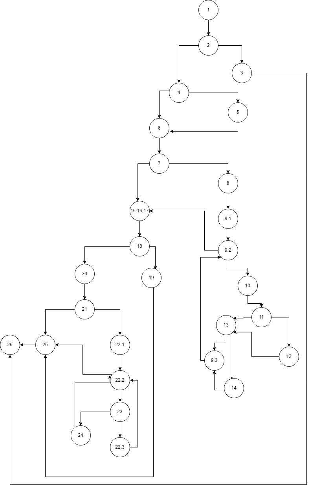

# Втора лабораториска вежба по Софтверско инженерство

## Миле Стојменов, бр. на индекс 172015

### Control Flow Graph

На графот од јазелот 24 треба да има врска со јазелот 22.3 наместо во 22.2. Цикломатската комплексност останува иста

## Цикломатска комплексност
Цикоматската комплексност на овој код е 11. Таа ја добив бројајки ги регионите на цртежот а истото може да се провери со формулата на предикатни јазли + 1

### Тест случаи според критериумот Every branch:

###### Тест 1- User==null
###### Тест 2- username==null, password has special char, valid email
###### Тест 3- username==password and email is not valid
###### Тест 4- !password.contains(" "), username and email match.

### Тест случаи според multiple condition:
##### (user==null || user.getPassword()==null || user.getEmail()==null)
###### Тест 1- User==null
###### Тест 2- password==null
###### Тест 3- email==null
###### Тест 4- FALSE || FALSE || FALSE

### Објаснување на напишаните unit tests
Тестовите се напишани користејки JUnit5.
Во ExceptionTest се проверува фрлање на исклучок. Во Test1 и Test2 се проверува кога не е валидно. Test3_valid проверува кога има match. Со multipleConditionTest се проверуваме три сценарија каде барем еден од условите е исполнет и четвртото сценарио каде сите три усови не се исполнети.
